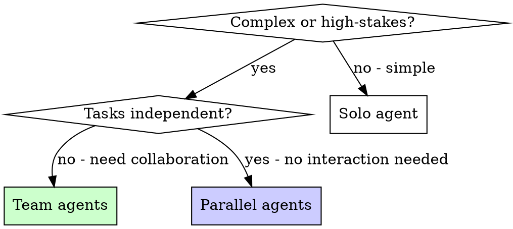

# Team Agents

## Overview

Solo agents work independently on isolated tasks. Team agents collaborate — they take different roles, review each other's work, and converge on better solutions.

**Core principle:** Multiple perspectives catch what a single agent misses. Use teams for complex or high-stakes work.

**Announce at start:** "I'm using the team-agents skill — dispatching a collaborative team."

## When to Use

**Use when:**
- `--team` flag is passed to any command
- Task is complex enough that one agent would miss things
- High-stakes changes where mistakes are costly
- Debugging spans multiple subsystems
- Implementation touches critical paths

**Don't use when:**
- Task is straightforward (one file, clear fix)
- Tasks are truly independent (use `compozy:parallel-agents` instead)
- Speed matters more than thoroughness



## Team vs Parallel Agents

| Aspect | Parallel Agents | Team Agents |
|--------|----------------|-------------|
| **Relationship** | Independent, no interaction | Collaborative, review each other |
| **Goal** | Different problems simultaneously | Same problem, different perspectives |
| **Communication** | None — results merged at end | Findings shared between agents |
| **Best for** | 3+ unrelated failures | Complex single problem |
| **Speed** | Fastest (true parallel) | Thorough (sequential collaboration) |

## Team Compositions

### Spec Review Team (orchestrate --team, Phase 3)

Used during Phase 3 (Tech Spec Generation). After the spec-generator produces the spec, two reviewers validate it before the user sees it.

**Roles:**
1. **Spec Critic** — Reviews for gaps, weaknesses, and over-engineering
2. **Testability Reviewer** — Ensures every requirement is verifiable

**Flow:**
```
Phase 3 (after spec generation):
  1. Dispatch both reviewers in parallel with the generated spec + codebase context
  2. Spec Critic: "Review this tech spec for:
      - Missing edge cases or error scenarios
      - Unclear or ambiguous interfaces
      - Over-engineering (YAGNI violations)
      - Inconsistencies with existing codebase patterns
      - Missing non-functional requirements (performance, security)
      Report issues by severity."
  3. Testability Reviewer: "Review this tech spec for:
      - Acceptance criteria that can't be tested (vague, subjective)
      - Interfaces that can't be mocked or stubbed
      - Missing test scenarios for each component
      - Dependencies that make testing hard
      Report untestable items and suggest how to make them testable."
  4. Synthesize findings
  5. If critical issues: re-run spec-generator with feedback, then re-review
  6. If clean: present spec to user for approval
```

**Why this helps:**
- Catches spec gaps BEFORE implementation (10x cheaper than fixing code)
- Testability review prevents "we can't test this" surprises in Phase 5
- Two perspectives: one on design quality, one on verifiability

### Decomposition Review Team (orchestrate --team, Phase 4)

Used during Phase 4 (Task Decomposition). After the task-decomposer produces the manifest, two reviewers validate it before execution.

**Roles:**
1. **Dependency Auditor** — Validates task ordering and isolation
2. **Complexity Estimator** — Flags tasks that need splitting or special attention

**Flow:**
```
Phase 4 (after task decomposition):
  1. Dispatch both reviewers in parallel with the manifest + tech spec
  2. Dependency Auditor: "Review this task manifest for:
      - Hidden dependencies between tasks in the same wave
      - File exclusivity violations (two tasks touching the same file)
      - Incorrect wave ordering (task depends on something not yet built)
      - Missing interface contracts between waves
      Report ordering issues and file conflicts."
  3. Complexity Estimator: "Review this task manifest for:
      - Tasks that are too large (should be split into subtasks)
      - High-risk tasks that need opus model instead of sonnet
      - Acceptance criteria that are too vague to implement
      - Tasks with unclear scope boundaries
      Flag tasks and suggest adjustments."
  4. Synthesize findings
  5. If wave ordering or file exclusivity is wrong: re-run task-decomposer with feedback
  6. If clean: present manifest to user for approval
```

**Why this helps:**
- Prevents parallel execution conflicts (file exclusivity violations = broken builds)
- Catches tasks too large for a single agent (avoids BLOCKED status in Phase 5)
- Validates wave ordering before spending time on execution

### Implementation Team (orchestrate --team, Phase 5)

Used during Phase 5 (Task Execution). Each wave dispatches a team instead of solo implementers.

**Roles:**
1. **Implementer** — Writes the code following TDD discipline
2. **Reviewer** — Reviews each implementer's output before the wave completes
3. **Architect** — Monitors cross-cutting concerns across waves (shared types, API consistency, naming)

**Flow:**
```
Wave N:
  1. Dispatch implementer agents (parallel, one per task — same as solo mode)
  2. Collect results
  3. Dispatch reviewer agent with ALL wave outputs:
     "Review these implementations for:
      - Correctness against spec
      - Cross-task consistency (naming, patterns, interfaces)
      - Test quality (real behavior tested, not mocks)
      - Edge cases missed
      Report issues by severity."
  4. If critical issues: re-dispatch implementers with review feedback
  5. If clean: proceed to next wave

After all waves:
  6. Dispatch architect agent with full implementation:
     "Review the complete implementation for:
      - Architectural coherence across all waves
      - Interface consistency between components
      - Missing integration points
      - Patterns that diverged from codebase conventions
      Report structural issues."
  7. Fix any architectural issues before Phase 6
```

**Why this helps:**
- Reviewer catches bugs implementers miss (fresh eyes on each wave)
- Architect catches cross-wave drift (naming divergence, inconsistent patterns)
- Issues caught per-wave, not at the end (cheaper to fix early)

### Debugging Team (debug --team)

Used during Phase 1 (Root Cause Investigation). Multiple agents investigate simultaneously from different angles.

**Roles:**
1. **Data Flow Tracer** — Traces the bug backward through call chains (root-cause-tracing technique)
2. **Change Analyst** — Examines recent git changes, diffs, and commit history for likely culprits
3. **Pattern Scout** — Finds similar working code in the codebase and identifies what's different

**Flow:**
```
Phase 1 (parallel investigation):
  1. Dispatch all 3 agents simultaneously with the bug description
  2. Data Flow Tracer: "Trace the error backward through the call chain.
     Where does the bad value originate? Follow it up to the source.
     Return: the trace chain and suspected root cause."
  3. Change Analyst: "Check git log, git diff, recent commits.
     What changed that could cause this? Check dependencies, config.
     Return: list of suspicious changes with file paths and reasoning."
  4. Pattern Scout: "Find similar working code in this codebase.
     What's different between working and broken? Compare patterns.
     Return: differences found and what the working version does right."

Phase 1 (synthesis):
  5. Read all 3 reports
  6. Synthesize findings — where do the investigations converge?
  7. Present consolidated root cause hypothesis to user
  8. Proceed to Phase 2-4 as normal
```

**Why this helps:**
- Three perspectives on the same bug surface different evidence
- Convergence = high confidence (if all 3 point to same cause, it's likely right)
- Divergence = the bug is more complex than it appears (investigate further)

### Sentry Investigation Team (sentry-fix --team)

Used during Phase 2 (Deep Sentry Analysis). Multiple agents investigate the Sentry issue from different angles simultaneously.

**Roles:**
1. **Sentry Data Analyst** — Gathers all Sentry data: stack traces, breadcrumbs, event distributions, tag breakdowns, traces, and Seer AI analysis
2. **Codebase Investigator** — Reads stack trace files in the local codebase, traces data flow through the call chain, checks `git blame`/`git log` for recent changes to affected files
3. **Impact Assessor** — Analyzes tag distributions (browser, OS, environment, release), finds related Sentry issues, estimates blast radius and user impact

**Flow:**
```
Phase 2 (parallel investigation):
  1. Dispatch all 3 agents simultaneously with the Sentry issue ID and initial details
  2. Sentry Data Analyst (tools: mcp__plugin_sentry_sentry__*):
     "Gather ALL available Sentry data for this issue:
      - Full stack trace with source context
      - Breadcrumbs leading to the error
      - Event distribution across time, environment, release
      - Tag value distributions (browser, OS, transaction)
      - Trace spans if available
      - Seer AI analysis
      Return: structured analysis report."
  3. Codebase Investigator (tools: Read, Glob, Grep, Bash(git *)):
     "Read the files referenced in this stack trace: [stack trace files].
      - Trace the data flow backward from the crash point
      - Check git log and git blame for recent changes to these files
      - Find similar working code paths in the codebase
      Return: local code context and suspicious recent changes."
  4. Impact Assessor (tools: mcp__plugin_sentry_sentry__*):
     "Analyze the impact scope of this issue:
      - Get tag distributions (browser, OS, environment, release, transaction)
      - Search for related issues with similar error types
      - Determine if this is a regression (started with a specific release)
      Return: impact report with blast radius estimate."

Phase 2 (synthesis):
  5. Read all 3 reports
  6. Synthesize findings — where do the investigations converge?
  7. Cross-reference: Sentry data + local code + impact scope = root cause hypothesis
  8. Proceed to Phase 3 with consolidated evidence
```

**Why this helps:**
- Sentry data + local code + impact analysis cover all investigative angles simultaneously
- Convergence = high confidence (if data analyst and codebase investigator point to same cause, it's likely right)
- Impact assessor prevents tunnel vision — the fix must address ALL affected environments, not just the first one found

### Jira Bug Investigation Team (jira --team, Phase 2, `$FLOW = bug`)

Used during Phase 2 (Deep Ticket Analysis) when the ticket is a Bug/Defect. Multiple agents investigate the Jira bug from different angles simultaneously.

**Roles:**
1. **Ticket Context Analyst** — Gathers all Jira data: description, acceptance criteria, linked issues, subtasks, comments, sprint/epic context
2. **Codebase Investigator** — Reads files referenced in the ticket, traces data flow, checks `git blame`/`git log` for recent changes to affected areas
3. **Impact Assessor** — Analyzes related bugs in the same sprint/epic, examines linked issues, estimates scope of the fix

**Flow:**
```
Phase 2 (parallel investigation):
  1. Dispatch all 3 agents simultaneously with the Jira ticket key and initial details
  2. Ticket Context Analyst (tools: mcp__jira_*):
     "Gather ALL available Jira data for this bug ticket:
      - Full description with reproduction steps
      - Acceptance criteria / definition of done
      - Linked issues (especially 'blocks' and 'is blocked by')
      - Subtasks and their status
      - Comments with decisions and clarifications
      - Sprint goal and epic context
      Return: structured ticket analysis report."
  3. Codebase Investigator (tools: Read, Glob, Grep, Bash(git *)):
     "Investigate the codebase based on this bug ticket: [description summary].
      - Read files likely related to the reported behavior
      - Trace data flow through the affected code paths
      - Check git log and git blame for recent changes
      - Find similar working code paths
      Return: local code context and suspicious recent changes."
  4. Impact Assessor (tools: mcp__jira_*):
     "Analyze the impact scope of this bug:
      - Search for related bugs in the same sprint/epic/component
      - Check linked issues for dependencies and duplicates
      - Estimate fix scope (single file vs multi-component)
      Return: impact report with related tickets and scope estimate."

Phase 2 (synthesis):
  5. Read all 3 reports
  6. Synthesize findings — where do the investigations converge?
  7. Cross-reference: ticket context + local code + impact = root cause hypothesis
  8. Proceed to Phase 3 with consolidated evidence
```

**Why this helps:**
- Ticket data + local code + impact analysis cover all investigative angles simultaneously
- Convergence = high confidence (if analyst and investigator point to same cause, it's likely right)
- Impact assessor prevents tunnel vision — the fix must address ALL related issues, not just the immediate ticket

### Jira Story Planning Team (jira --team, Phase 2, `$FLOW = story`)

Used during Phase 2 (Deep Ticket Analysis) when the ticket is a Story/Task/Improvement. Multiple agents analyze the ticket and codebase to prepare for spec generation.

**Roles:**
1. **Ticket Context Analyst** — Gathers all Jira data: description, acceptance criteria, linked issues, subtasks, comments, sprint/epic context
2. **Codebase Explorer** — Explores architecture, similar features, existing patterns relevant to the story
3. **Requirements Analyst** — Extracts structured requirements from the ticket and linked issues, identifies gaps and ambiguities

**Flow:**
```
Phase 2 (parallel investigation):
  1. Dispatch all 3 agents simultaneously with the Jira ticket key and initial details
  2. Ticket Context Analyst (tools: mcp__jira_*):
     "Gather ALL available Jira data for this story/task:
      - Full description with user value statement
      - Acceptance criteria / definition of done
      - Linked issues (especially related stories and epics)
      - Subtasks and their status
      - Comments with decisions and clarifications
      - Sprint goal and epic context
      Return: structured ticket analysis report."
  3. Codebase Explorer (tools: Read, Glob, Grep):
     "Explore the codebase for context relevant to this story: [description summary].
      - Find similar features already implemented
      - Identify architectural patterns to follow
      - Map affected modules and components
      - Note conventions for testing, naming, structure
      Return: codebase context with patterns and conventions."
  4. Requirements Analyst (tools: mcp__jira_*, Read):
     "Extract structured requirements from this ticket and its linked issues:
      - Convert acceptance criteria into testable requirements
      - Identify implicit requirements from the description
      - Check linked issues for additional requirements or constraints
      - Flag gaps, ambiguities, or conflicting requirements
      Return: structured requirements list with gaps flagged."

Phase 2 (synthesis):
  5. Read all 3 reports
  6. Synthesize findings — requirements + codebase context + ticket data
  7. Produce consolidated input for spec generation
  8. Proceed to Phase 3 with full context
```

**Why this helps:**
- Requirements analyst catches implicit requirements and gaps before spec generation
- Codebase explorer ensures the spec follows existing patterns
- Ticket analyst provides full stakeholder context (comments, linked issues, epic goals)

### Design Team (design --team)

Used during approach exploration. Multiple agents propose designs independently.

**Roles:**
1. **Approach Explorer A** — Designs solution favoring simplicity and minimal changes
2. **Approach Explorer B** — Designs solution favoring extensibility and future-proofing
3. **Devil's Advocate** — Reviews both approaches for weaknesses, edge cases, and overlooked requirements

**Flow:**
```
  1. After clarifying questions are answered:
     Dispatch Explorer A and Explorer B with same context
  2. Collect both approaches
  3. Dispatch Devil's Advocate with both approaches:
     "Review both designs. For each:
      - What breaks under load/scale?
      - What edge cases are missed?
      - What's the maintenance burden in 6 months?
      - Which is easier to test?
      Report strengths and weaknesses of each."
  4. Present all findings to user with recommendation
```

## Dispatch Pattern

When dispatching team agents, each agent gets:

1. **Role description** — What perspective they bring
2. **Shared context** — The same problem/spec/bug description
3. **Specific focus** — What they should look for that others won't
4. **Output format** — What to return (findings, code, review)

**Example prompt for a reviewer agent:**
```markdown
You are the REVIEWER for Wave 2 of an implementation team.

## Your Role
Review the implementations below for correctness, consistency, and quality.
You are NOT the implementer — your job is to find what they missed.

## Context
[Tech spec excerpt for this wave's tasks]

## Implementations to Review
[Task T-3 output: files created, changes made]
[Task T-4 output: files created, changes made]

## Review Checklist
1. Does each implementation match the spec? (nothing more, nothing less)
2. Are the implementations consistent with each other? (naming, patterns)
3. Are tests testing real behavior? (not mocks)
4. Are edge cases covered?
5. Any issues that will break integration with other waves?

## Output
Return a review with issues categorized by severity:
- CRITICAL: Must fix before proceeding
- MODERATE: Should fix
- MINOR: Nice to fix
```

## Common Mistakes

**Overlapping scope:** Each agent should have a distinct role. Two agents doing the same thing wastes resources.

**Missing synthesis:** Don't just collect agent outputs — synthesize them. Where do findings converge? Where do they disagree?

**Too many agents:** 2-3 agents per team is optimal. More than 4 creates coordination overhead that outweighs benefits.

**No shared context:** Each agent needs the same base context. Don't assume they'll figure it out.

## Verification

After team work completes:
1. **Synthesize findings** — Don't just concatenate reports
2. **Check for contradictions** — Agents may disagree; investigate why
3. **Verify the synthesis** — Run tests, check output, evidence before claims
4. **Credit the right perspective** — If one agent found the real issue, the others' work still narrowed the search space
