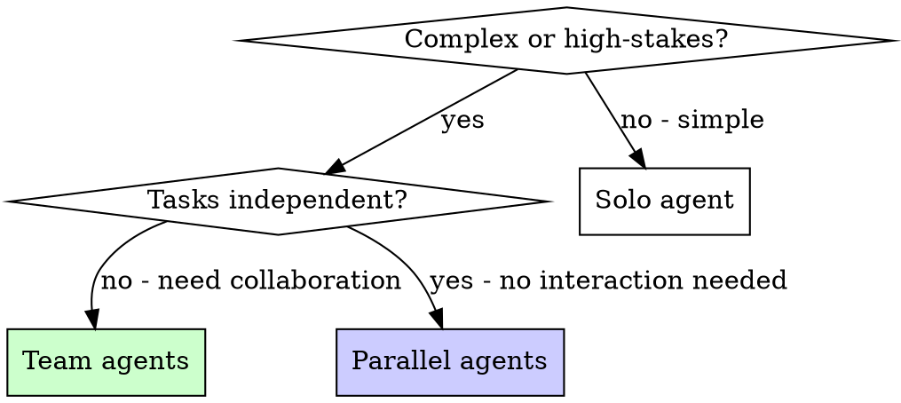

# Team Agents

## Overview

Solo agents work independently on isolated tasks. Team agents collaborate — they take different roles, review each other's work, and converge on better solutions.

**Core principle:** Multiple perspectives catch what a single agent misses. Use teams for complex or high-stakes work.

**Announce at start:** "I'm using the team-agents skill — dispatching a collaborative team."

## When to Use

**Use when:**
- `--team` flag is passed to any command
- Task is complex enough that one agent would miss things
- High-stakes changes where mistakes are costly
- Debugging spans multiple subsystems
- Implementation touches critical paths

**Don't use when:**
- Task is straightforward (one file, clear fix)
- Tasks are truly independent (use `compozy:parallel-agents` instead)
- Speed matters more than thoroughness



## Team vs Parallel Agents

| Aspect | Parallel Agents | Team Agents |
|--------|----------------|-------------|
| **Relationship** | Independent, no interaction | Collaborative, review each other |
| **Goal** | Different problems simultaneously | Same problem, different perspectives |
| **Communication** | None — results merged at end | Findings shared between agents |
| **Best for** | 3+ unrelated failures | Complex single problem |
| **Speed** | Fastest (true parallel) | Thorough (sequential collaboration) |

## Team Compositions

Select the appropriate team based on context, then read its reference file for detailed roles and flow:

| Team | When | Reference |
|------|------|-----------|
| **Spec Review** | `orchestrate --team`, Phase 3 | See [spec-review-team](${CLAUDE_SKILL_DIR}/references/spec-review-team.md) |
| **Decomposition Review** | `orchestrate --team`, Phase 4 | See [decomposition-review-team](${CLAUDE_SKILL_DIR}/references/decomposition-review-team.md) |
| **Implementation** | `orchestrate --team`, Phase 5 | See [implementation-team](${CLAUDE_SKILL_DIR}/references/implementation-team.md) |
| **Debugging** | `debug --team` | See [debugging-team](${CLAUDE_SKILL_DIR}/references/debugging-team.md) |
| **Sentry Investigation** | `sentry-fix --team` | See [sentry-team](${CLAUDE_SKILL_DIR}/references/sentry-team.md) |
| **Jira Bug Investigation** | `jira --team`, `$FLOW = bug` | See [jira-bug-team](${CLAUDE_SKILL_DIR}/references/jira-bug-team.md) |
| **Jira Story Planning** | `jira --team`, `$FLOW = story` | See [jira-story-team](${CLAUDE_SKILL_DIR}/references/jira-story-team.md) |
| **Design** | `design --team` | See [design-team](${CLAUDE_SKILL_DIR}/references/design-team.md) |

## Dispatch Pattern

When dispatching team agents, each agent gets:

1. **Role description** — What perspective they bring
2. **Shared context** — The same problem/spec/bug description
3. **Specific focus** — What they should look for that others won't
4. **Output format** — What to return (findings, code, review)

**Example prompt for a reviewer agent:**
```markdown
You are the REVIEWER for Wave 2 of an implementation team.

## Your Role
Review the implementations below for correctness, consistency, and quality.
You are NOT the implementer — your job is to find what they missed.

## Context
[Tech spec excerpt for this wave's tasks]

## Implementations to Review
[Task T-3 output: files created, changes made]
[Task T-4 output: files created, changes made]

## Review Checklist
1. Does each implementation match the spec? (nothing more, nothing less)
2. Are the implementations consistent with each other? (naming, patterns)
3. Are tests testing real behavior? (not mocks)
4. Are edge cases covered?
5. Any issues that will break integration with other waves?

## Output
Return a review with issues categorized by severity:
- CRITICAL: Must fix before proceeding
- MODERATE: Should fix
- MINOR: Nice to fix
```

## Common Mistakes

**Overlapping scope:** Each agent should have a distinct role. Two agents doing the same thing wastes resources.

**Missing synthesis:** Don't just collect agent outputs — synthesize them. Where do findings converge? Where do they disagree?

**Too many agents:** 2-3 agents per team is optimal. More than 4 creates coordination overhead that outweighs benefits.

**No shared context:** Each agent needs the same base context. Don't assume they'll figure it out.

## Verification

After team work completes:
1. **Synthesize findings** — Don't just concatenate reports
2. **Check for contradictions** — Agents may disagree; investigate why
3. **Verify the synthesis** — Run tests, check output, evidence before claims
4. **Credit the right perspective** — If one agent found the real issue, the others' work still narrowed the search space
