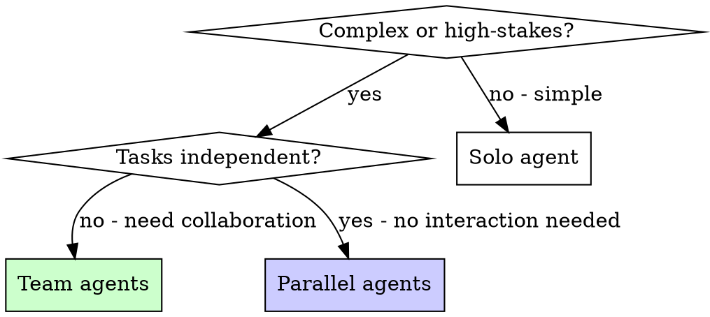

# Team Agents

## Overview

Solo agents work independently on isolated tasks. Team agents collaborate — they take different roles, review each other's work, and converge on better solutions.

**Core principle:** Multiple perspectives catch what a single agent misses. Use teams for complex or high-stakes work.

**Announce at start:** "I'm using the team-agents skill — dispatching a collaborative team."

## When to Use

**Use when:**
- `--team` flag is passed to any command
- Task is complex enough that one agent would miss things
- High-stakes changes where mistakes are costly
- Debugging spans multiple subsystems
- Implementation touches critical paths

**Don't use when:**
- Task is straightforward (one file, clear fix)
- Tasks are truly independent (use `compozy:parallel-agents` instead)
- Speed matters more than thoroughness



## Team vs Parallel Agents

| Aspect | Parallel Agents | Team Agents |
|--------|----------------|-------------|
| **Relationship** | Independent, no interaction | Collaborative, review each other |
| **Goal** | Different problems simultaneously | Same problem, different perspectives |
| **Communication** | None — results merged at end | Findings shared between agents |
| **Best for** | 3+ unrelated failures | Complex single problem |
| **Speed** | Fastest (true parallel) | Thorough (sequential collaboration) |

## Team Compositions

### Implementation Team (orchestrate --team)

Used during Phase 5 (Task Execution). Each wave dispatches a team instead of solo implementers.

**Roles:**
1. **Implementer** — Writes the code following TDD discipline
2. **Reviewer** — Reviews each implementer's output before the wave completes
3. **Architect** — Monitors cross-cutting concerns across waves (shared types, API consistency, naming)

**Flow:**
```
Wave N:
  1. Dispatch implementer agents (parallel, one per task — same as solo mode)
  2. Collect results
  3. Dispatch reviewer agent with ALL wave outputs:
     "Review these implementations for:
      - Correctness against spec
      - Cross-task consistency (naming, patterns, interfaces)
      - Test quality (real behavior tested, not mocks)
      - Edge cases missed
      Report issues by severity."
  4. If critical issues: re-dispatch implementers with review feedback
  5. If clean: proceed to next wave

After all waves:
  6. Dispatch architect agent with full implementation:
     "Review the complete implementation for:
      - Architectural coherence across all waves
      - Interface consistency between components
      - Missing integration points
      - Patterns that diverged from codebase conventions
      Report structural issues."
  7. Fix any architectural issues before Phase 6
```

**Why this helps:**
- Reviewer catches bugs implementers miss (fresh eyes on each wave)
- Architect catches cross-wave drift (naming divergence, inconsistent patterns)
- Issues caught per-wave, not at the end (cheaper to fix early)

### Debugging Team (debug --team)

Used during Phase 1 (Root Cause Investigation). Multiple agents investigate simultaneously from different angles.

**Roles:**
1. **Data Flow Tracer** — Traces the bug backward through call chains (root-cause-tracing technique)
2. **Change Analyst** — Examines recent git changes, diffs, and commit history for likely culprits
3. **Pattern Scout** — Finds similar working code in the codebase and identifies what's different

**Flow:**
```
Phase 1 (parallel investigation):
  1. Dispatch all 3 agents simultaneously with the bug description
  2. Data Flow Tracer: "Trace the error backward through the call chain.
     Where does the bad value originate? Follow it up to the source.
     Return: the trace chain and suspected root cause."
  3. Change Analyst: "Check git log, git diff, recent commits.
     What changed that could cause this? Check dependencies, config.
     Return: list of suspicious changes with file paths and reasoning."
  4. Pattern Scout: "Find similar working code in this codebase.
     What's different between working and broken? Compare patterns.
     Return: differences found and what the working version does right."

Phase 1 (synthesis):
  5. Read all 3 reports
  6. Synthesize findings — where do the investigations converge?
  7. Present consolidated root cause hypothesis to user
  8. Proceed to Phase 2-4 as normal
```

**Why this helps:**
- Three perspectives on the same bug surface different evidence
- Convergence = high confidence (if all 3 point to same cause, it's likely right)
- Divergence = the bug is more complex than it appears (investigate further)

### Design Team (design --team)

Used during approach exploration. Multiple agents propose designs independently.

**Roles:**
1. **Approach Explorer A** — Designs solution favoring simplicity and minimal changes
2. **Approach Explorer B** — Designs solution favoring extensibility and future-proofing
3. **Devil's Advocate** — Reviews both approaches for weaknesses, edge cases, and overlooked requirements

**Flow:**
```
  1. After clarifying questions are answered:
     Dispatch Explorer A and Explorer B with same context
  2. Collect both approaches
  3. Dispatch Devil's Advocate with both approaches:
     "Review both designs. For each:
      - What breaks under load/scale?
      - What edge cases are missed?
      - What's the maintenance burden in 6 months?
      - Which is easier to test?
      Report strengths and weaknesses of each."
  4. Present all findings to user with recommendation
```

## Dispatch Pattern

When dispatching team agents, each agent gets:

1. **Role description** — What perspective they bring
2. **Shared context** — The same problem/spec/bug description
3. **Specific focus** — What they should look for that others won't
4. **Output format** — What to return (findings, code, review)

**Example prompt for a reviewer agent:**
```markdown
You are the REVIEWER for Wave 2 of an implementation team.

## Your Role
Review the implementations below for correctness, consistency, and quality.
You are NOT the implementer — your job is to find what they missed.

## Context
[Tech spec excerpt for this wave's tasks]

## Implementations to Review
[Task T-3 output: files created, changes made]
[Task T-4 output: files created, changes made]

## Review Checklist
1. Does each implementation match the spec? (nothing more, nothing less)
2. Are the implementations consistent with each other? (naming, patterns)
3. Are tests testing real behavior? (not mocks)
4. Are edge cases covered?
5. Any issues that will break integration with other waves?

## Output
Return a review with issues categorized by severity:
- CRITICAL: Must fix before proceeding
- MODERATE: Should fix
- MINOR: Nice to fix
```

## Common Mistakes

**Overlapping scope:** Each agent should have a distinct role. Two agents doing the same thing wastes resources.

**Missing synthesis:** Don't just collect agent outputs — synthesize them. Where do findings converge? Where do they disagree?

**Too many agents:** 2-3 agents per team is optimal. More than 4 creates coordination overhead that outweighs benefits.

**No shared context:** Each agent needs the same base context. Don't assume they'll figure it out.

## Verification

After team work completes:
1. **Synthesize findings** — Don't just concatenate reports
2. **Check for contradictions** — Agents may disagree; investigate why
3. **Verify the synthesis** — Run tests, check output, evidence before claims
4. **Credit the right perspective** — If one agent found the real issue, the others' work still narrowed the search space
