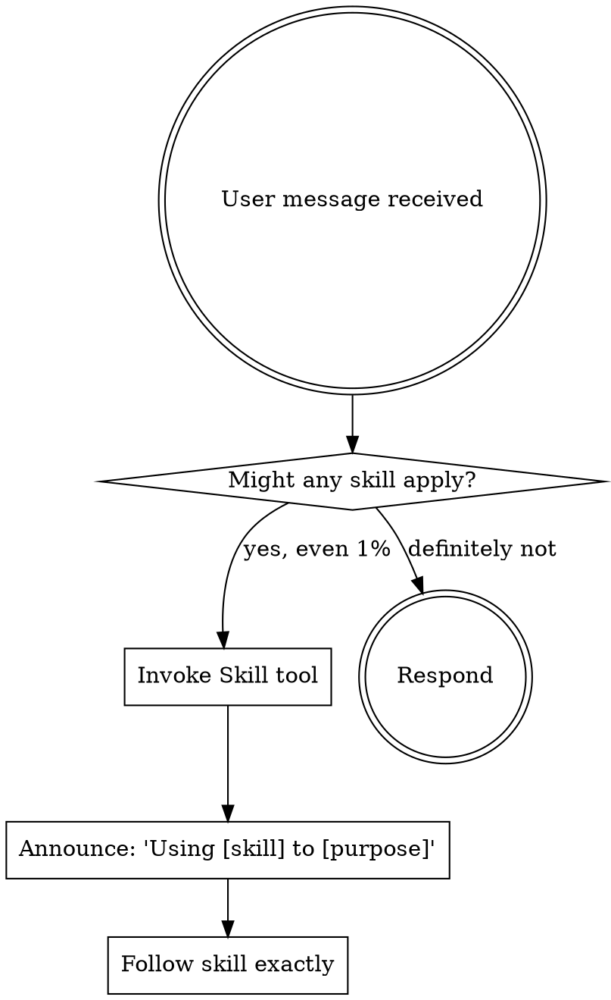

<SUBAGENT-STOP>
If you were dispatched as a subagent to execute a specific task, skip this skill.
</SUBAGENT-STOP>

<EXTREMELY-IMPORTANT>
If you think there is even a 1% chance a skill might apply to what you are doing, you ABSOLUTELY MUST invoke the skill.

IF A SKILL APPLIES TO YOUR TASK, YOU DO NOT HAVE A CHOICE. YOU MUST USE IT.

This is not negotiable. This is not optional. You cannot rationalize your way out of this.
</EXTREMELY-IMPORTANT>

## Instruction Priority

Compozy skills override default system prompt behavior, but **user instructions always take precedence**:

1. **User's explicit instructions** (CLAUDE.md, direct requests) — highest priority
2. **Compozy skills** — override default system behavior where they conflict
3. **Default system prompt** — lowest priority

If CLAUDE.md says "don't use TDD" and a skill says "always use TDD," follow the user's instructions. The user is in control.

## How to Access Skills

Use the `Skill` tool. When you invoke a skill, its content is loaded and presented to you — follow it directly. Never use the Read tool on skill files.

## Iron Rules

These apply at all times, regardless of context:

1. **No code without a failing test** — Write the test first. Watch it fail. Then implement.
2. **No claims without verification** — Run the command, read the output, THEN claim the result.
3. **No fixes without root cause** — Find why it's broken before changing code.
4. **No AI attribution** — Never mention Claude, AI, or automation in code, commits, or PRs.

## Available Skills

| Skill | When to Use |
|-------|-------------|
| `compozy:tdd` | Before writing any production code — new features, bug fixes, refactoring |
| `compozy:systematic-debugging` | When encountering any bug, test failure, or unexpected behavior |
| `compozy:verification` | Before claiming work is complete, fixed, or passing |
| `compozy:worktrees` | When starting feature work that needs isolation from current workspace |
| `compozy:parallel-agents` | When facing 2+ independent tasks that can be worked on concurrently |
| `compozy:pr-review` | When reviewing code — comment tone, false positives, suggestion guidelines |
| `compozy:branch-completion` | When implementation is complete and you need to integrate the work |
| `compozy:spec-authoring` | When writing or reviewing technical specifications |
| `compozy:team-agents` | When `--team` flag is passed or complex work benefits from collaborative agents |

## The Rule

**Invoke relevant or requested skills BEFORE any response or action.** Even a 1% chance a skill might apply means you should invoke the skill to check. If an invoked skill turns out to be wrong for the situation, you don't need to use it.

## Red Flags

These thoughts mean STOP — you're rationalizing:

| Thought | Reality |
|---------|---------|
| "This is just a simple question" | Questions are tasks. Check for skills. |
| "I need more context first" | Skill check comes BEFORE clarifying questions. |
| "Let me explore the codebase first" | Skills tell you HOW to explore. Check first. |
| "This doesn't need a formal skill" | If a skill exists, use it. |
| "I remember this skill" | Skills evolve. Read current version. |
| "The skill is overkill" | Simple things become complex. Use it. |
| "I'll just do this one thing first" | Check BEFORE doing anything. |

## Skill Priority

When multiple skills could apply, use this order:

1. **Process skills first** (debugging, TDD) — these determine HOW to approach the task
2. **Implementation skills second** — these guide execution

"Build X" → design first, then implementation skills.
"Fix this bug" → debugging first, then TDD for the fix.

## Skill Types

**Rigid** (TDD, debugging, verification): Follow exactly. Don't adapt away discipline.

**Flexible** (worktrees, parallel-agents): Adapt principles to context.

The skill itself tells you which.

## User Instructions

Instructions say WHAT, not HOW. "Add X" or "Fix Y" doesn't mean skip workflows.
